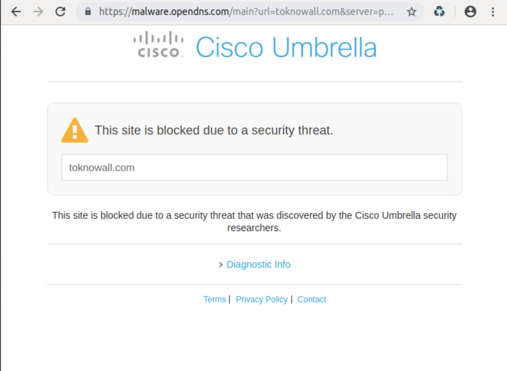

[](https://developer.cisco.com/codeexchange/github/repo/suchandanreddy/sdwan-umbrella-policy)

# Objective 

*   How to use vManage REST APIs to configure and monitor DNS Security (Umbrella) policy on SDWAN edge router. 
*   How to use Umbrella reporting APIs


# Requirements

To use this code you will need:

* Python 3.7+
* SDWAN edge router with device template attached.
* Configure Umbrella API Token on vManage.

# Install and Setup

Clone the code to local machine.

```
git clone https://github.com/suchandanreddy/sdwan-umbrella-policy.git
cd sdwan-umbrella-policy
```
Setup Python Virtual Environment (requires Python 3.7+)

```
python3.7 -m venv venv
source venv/bin/activate
pip3 install -r requirements.txt
```

Setup local environment variables to provide vManage login details and Device Template Name which is currently attached to the SDWAN Edge router. 

Examples:

For MAC OSX and Ubuntu Environment:

```
export vmanage_host=10.10.10.10
export vmanage_port=443
export username=admin
export password=admin
export device_template_name=BR2-CSR-1000v
```

For Windows Environment:

```
set vmanage_host=10.10.10.10
set vmanage_port=443
set username=admin
set password=admin
set device_template_name=BR2-CSR-1000v
```

After setting the env variables, run the python script `configure-umbrella-policy.py`

`configure-umbrella-policy.py` script does the below steps in sequence. 

1. Fetch uuid of Device Template provided. 
2. Fetch Feature Templates associated with this Device Template. 
3. Fetch Umbrella token list-id
4. Create a DNS Security Policy using below POST request payload.

<pre>
{"name":dnssecurity_policy_name,
           "type":"DNSSecurity",
           "description":dnssecurity_policy_name,
           "definition":{"localDomainBypassList":{},
           "matchAllVpn":True,
           "umbrellaDefault":True,
           "localDomainBypassEnabled":False,
           "dnsCrypt":True,
           "umbrellaData":
           {"ref":<b>your-umbrella-listId</b>}}}
</pre>

**Note** Above POST request payload can be modified based on your  DNS Security policy config requirements. 
    
5.  Create a Security Policy and attach the DNS Security policy to it. 
6.  Edit Device Template to attach the security policy and push it to the SDWAN edge router. 

**Sample Response**

```
$ python3 configure-umbrella-policy.py 

Fetching Template uuid of BR2-CSR-1000v

Fetching feature templates associated with BR2-CSR-1000v device template

Fetching Umbrella Token list-id

Creating DNS Security policy

Creating Security Policy

security policy uuid: c61d70e9-036c-43ef-8d4c-f733305d34c6

Device uuid: CSR-0e6b5cd8-e811-4d8b-afe9-4c397c87b19b

Fetching device csv values

Attaching new device template

Template push status is done
```

# Device configuration logs

<pre>
<b>BR-CSR1000v-2#!before config</b>
BR-CSR1000v-2#show sdwan run | sec umbrella
<b>BR-CSR1000v-2#!after config</b>
BR-CSR1000v-2#show sdwan run | sec umbrella
parameter-map type umbrella global
 token    <b>your-umbrella-token</b>
 dnscrypt
 vrf 10
  dns-resolver                 umbrella
  no match-local-domain-to-bypass
 !
BR-CSR1000v-2#
</pre>

Verify the umbrella device registration status using the command `show sdwan umbrella device-registration`

**Sample Response**

<pre>
BR-CSR1000v-2#show sdwan umbrella device-registration
NAME  STATUS       TAG    DEVICE ID         DESCRIPTION
-----------------------------------------------------------------------------
10    200 SUCCESS  vpn10  <b>your-device-id</b>  Device Id recieved successfully
</pre>

# Monitoring stats for DNS Security(Umbrella) Policy

## vManage REST APIs

Fetch number of DNS redirect packets using REST API resource URL : "statistics/umbrella/aggregation"

**Sample Query** (To retrieve DNS redirect packets count for last 10 hours with 1 hour interval)

```
{"query":{
           "condition":"AND","rules":
           [{"value":["10"],
           "field":"entry_time",
           "type":"date",
           "operator":"last_n_hours"},
           {"value":[device_id],
           "field":"vdevice_name",
           "type":"string",
           "operator":"in"},
           {"value":["umbrella"],
            "field":"type",
            "type":"string",
            "operator":"in"}]},
           "aggregation":
           {"metrics":[
               {"property":"redirect_pkts","type":"sum"}],
               "histogram":{"property":"entry_time",
                            "type":"minute",
                            "interval":60,
                            "order":"asc"}}}
```


## Umbrella Reporting APIs

**Step-1:**

-   Create Umbrella Reporting API keys. 

<pre>
In Umbrella dashboard(https://dashboard.umbrella.com/o/<b>your-org-id</b>/#/overview) , to create Umbrella <br>Reporting API keys follow the path, Admin -> API Keys -> "+" (Create button icon at the top right <br>corner of the screen) -> Select "Umbrella Reporting" -> Create.
</pre>

-  Copy the API key and secret to your code environment. (Please note for security reasons, Umbrella API secret would be shown only once right after creating the API keys)

**Step-2:**

- Use Umbrella APIs to fetch reports to verify if specific destination site is being allowed or blocked.

- Below URL needs org_id (org_id can be found in umbrella dashboard URL i.e. `https://dashboard.umbrella.com/o/<your-org-id>`) and destination site

**URL:**  `https://reports.api.umbrella.com/v1/organizations/{org_id}/destinations/{destination_site}/activity?limit=1`

- Optional query parameter **limit** can be used to limit the number of DNS requests details returned for provided destination site. 

**Step-3:**

- Export the SDWAN Edge router system-ip address(for vManage REST APIs), Umbrella API key, secret and Org-id details using below commands based on workstation environment. 

For MAC OSX and Ubuntu Environment:

```
export device_id=<SDWAN edge router system-ip>
export umbrella_key=<your-umbrella-key>
export umbrella_secret=<your-umbrella-secret>
export org_id=<your-org-id>
```

For Windows Environment:

```
set device_id=<SDWAN edge router system-ip>
set umbrella_key=<your-umbrella-key>
set umbrella_secret=<your-umbrella-secret>
set org_id=<your-org-id>
```

Run the python script - `python3 monitor-umbrella-policy.py`

**Note:** base64 encode of umbrella_api_key:umbrella_api_secret is used for Authorization in Umbrella APIs

**Sample Response**

<pre>
╒═════════════════════════╤════════════════════╕
│ Time                    │   Redirect packets │
╞═════════════════════════╪════════════════════╡
│ 07/02/2019 20:00:00 UTC │                  0 │
├─────────────────────────┼────────────────────┤
│ 07/02/2019 19:00:00 UTC │                 12 │
├─────────────────────────┼────────────────────┤
│ 07/02/2019 18:00:00 UTC │                 11 │
├─────────────────────────┼────────────────────┤
│ 07/02/2019 17:00:00 UTC │                  8 │
├─────────────────────────┼────────────────────┤
│ 07/02/2019 16:00:00 UTC │                  9 │
├─────────────────────────┼────────────────────┤
│ 07/02/2019 15:00:00 UTC │                 11 │
├─────────────────────────┼────────────────────┤
│ 07/02/2019 14:00:00 UTC │                 59 │
├─────────────────────────┼────────────────────┤
│ 07/02/2019 13:00:00 UTC │                 17 │
├─────────────────────────┼────────────────────┤
│ 07/02/2019 12:00:00 UTC │                 14 │
├─────────────────────────┼────────────────────┤
│ 07/02/2019 11:00:00 UTC │             101692 │
├─────────────────────────┼────────────────────┤
│ 07/02/2019 10:00:00 UTC │             204520 │
╘═════════════════════════╧════════════════════╛

Umbrella dashboard statistics for website toknowall.com

{
    "requests": [
        {
            "actionTaken": "BLOCKED",
            "categories": [
                "Malware"
            ],
            "datetime": "2019-07-02T18:43:20.000Z",
            "destination": "toknowall.com",
            "externalIp": <b>your-external-ip</b>,
            "internalIp": <b>your-internal-ip</b>,
            "originId": <b>your-org-id</b>,
            "originLabel": "BR-CSR1000v-2-vpn10",
            "originType": "Network Devices",
            "tags": []
        }
    ]
}

Umbrella dashboard statistics for website facebook.com

{
    "requests": [
        {
            "actionTaken": "BLOCKED",
            "categories": [
                "Social Networking",
                "Application"
            ],
            "datetime": "2019-07-02T18:41:21.202Z",
            "destination": "facebook.com",
            "externalIp": <b>your-external-ip</b>,
            "internalIp": <b>your-internal-ip</b>,
            "originId": <b>your-org-id</b>,
            "originLabel": "BR-CSR1000v-2-vpn10",
            "originType": "Network Devices",
            "tags": []
        }
    ]
}

Umbrella dashboard statistics for website ntp.ubuntu.com

{
    "requests": [
        {
            "actionTaken": "ALLOWED",
            "categories": [
                "Software/Technology",
                "Non-Profits"
            ],
            "datetime": "2019-07-03T03:17:49.433Z",
            "destination": "ntp.ubuntu.com",
            "externalIp": <b>your-external-ip</b>,
            "internalIp": <b>your-internal-ip</b>,
            "originId": <b>your-org-id</b>,
            "originLabel": "BR-CSR1000v-2-vpn10",
            "originType": "Network Devices",
            "tags": []
        }
    ]
}
</pre>

**Webpage access screenshots**

-   For this demo, I have enabled umbrella policy to block Social Networking. 

-   Below is the screenshot when the client VM access the malware site toknowall.com 




# References

[Umbrella Reporting APIs](https://docs.umbrella.com/umbrella-api/docs/overview)
